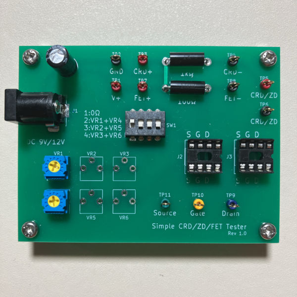
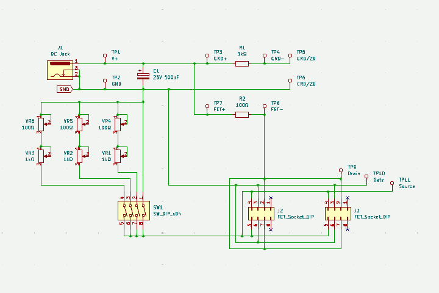
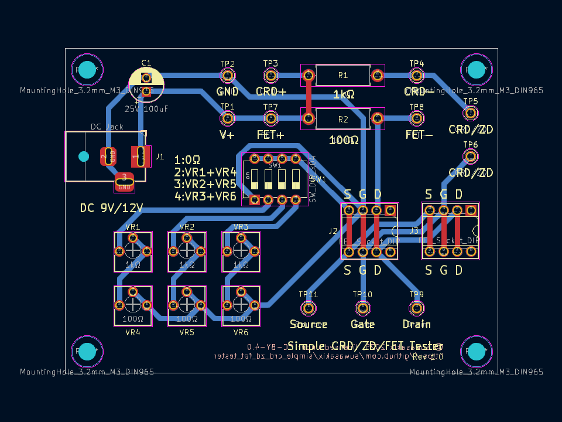
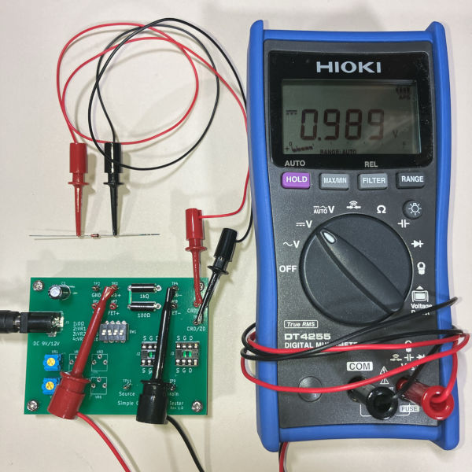
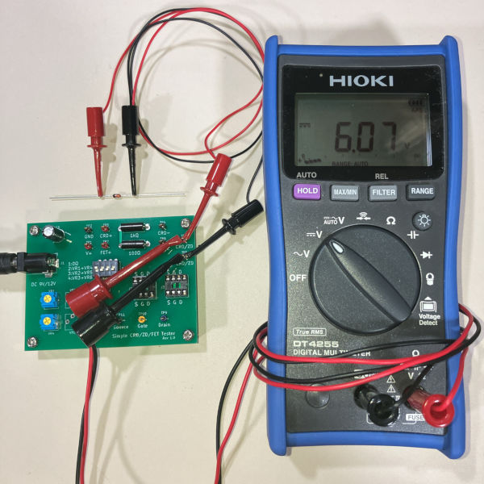
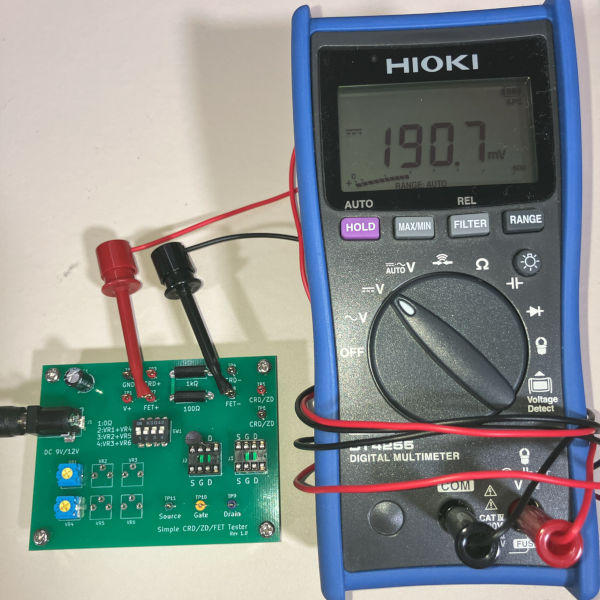
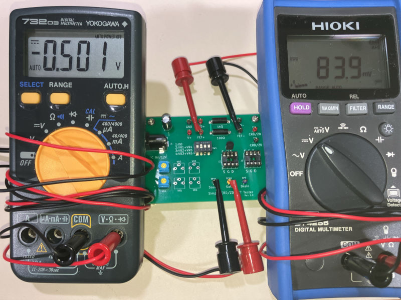

# Simple CRD/ZD/FET Tester

定電流ダイオード/定電圧ダイオード/FET 簡易測定器

&nbsp;

## 目次 - Contents

 - [このプリント基板について](#このプリント基板について---about-this-pcb)
 - [ガーバーデータのダウンロード](#ガーバーデータのダウンロード---download-gerber-data)
 - [部品リスト](#部品リスト---parts-list)
 - [便利なアイテム](#便利なアイテム---useful-items)
 - [使用例](#使用例---example-of-use)
 - [回路図](#回路図---pcb-schematic)
 - [レイアウト](#レイアウト---pcb-layout)
 - [開発環境](#開発環境---development-environment)
 - [ライセンスについて](#ライセンスについて---license)

&nbsp;

## このプリント基板について - About this PCB

このプリント基板は、ぺるけさんの [6AH4GT 全段差動プッシュプル・アンプ](http://www.op316.com/tubes/myamp/6ah4pp.htm) のページで紹介されている定電流ダイオード(CRD)・定電圧ダイオード(ZD)・FETの簡易測定回路を１枚の基板にまとめたものです。  

この基板では、CRD の電流値、ZD のツェナー電圧、J-FET の Idss およびバイアスの測定ができます。  

この基板は CRD、ZD、FET の簡易測定を目的としたものであり、自作のアンプに使用する半導体部品を選別するのに向いています。選別した半導体部品を第三者に頒布することを目的とする場合は、電流と電圧の両方を調整できるような高機能な測定器が必要になると思います。  

&nbsp;

## ガーバーデータのダウンロード - Download gerber data

こちらのページから「simple_crd_zd_fet_tester-gerber.zip」のファイルをダウンロードしてください。  

&emsp; https://www.github.com/suwasakix/simple_crd_zd_fet_tester/releases

このプロジェクトは、各自がプリント基板のガーバーデータをダウンロードして PCB 基板メーカーに基板製造を発注することを前提にしています。個人で発注可能な PCB 基板メーカーは国内外問わずありますが、近年では 10cm 四方以下の基板サイズであれば海外メーカーで格安に製造委託することが可能になりました。発注例として、深圳の Seeed studio が提供する PCB 製造サービス「[Fusion PCB](https://www.fusionpcb.jp)」に基板製造を発注する方法を[こちらのページ](docs/ORDER_PCB.md)で紹介しておきます。

本リポジトリの Release で公開しているガーバーデータは、Fusion PCB に発注して問題なく基板が製造されることを確認しております。

&nbsp;

## 回路図 - PCB schematic

CRD/ZD/FET の選別をしたことがある方には特に説明の必要もない回路ですが、使い方が分からない方は[使用例](#使用例---example-of-use)に目を通していただければと思います。

R1, R2 は電流値を測定するための抵抗なので高精度品か、あるいは抵抗値を実測してなるべく 1kΩ / 100Ω に近いものを使用してください。

VR1 ～ VR6 は FET のバイアス調整用の半固定ボリュームです。半固定ボリュームは実機回路のバランスを調整するために使われる部品で一旦調整が完了したら動かさないことから、一般的に半固定ボリュームの回転寿命は長くありません（ボリュームの回転を繰り返しているうちに接触面が劣化して抵抗値の調整ができなくなります）。本来であれば回転寿命がより長いボリュームを割り当てるべきですが、本基板は自作アンプの部品選別することが目的なので、使用頻度が多くなることはないだろうと判断して割り切りました。最初は VR1 と VR2 を使って、それらがダメになったら VR3 と VR4 を使って、その次に VR5 と VR6 で……と、半固定ボリュームは消耗品扱いの前提で使用しています。

電源には 9V または 12V の AC アダプターを使用してください。DC ジャックは 外径 5.5mm / 内径 2.1mm センタープラスのものが適合します。9V 角型電池に DC プラグ付 9V 電池スナップを接続して使ってもかまいません。

&nbsp;

## レイアウト - PCB layout

* 基板サイズ : W 80mm × H 60mm

&nbsp;

## 部品リスト - Parts list

* 通販による部品販売では、10個単位などでまとめ売りされている場合がしばしばあります。注文の際にはご注意ください。
* ☆ は使用しなければ省略可。

|部品種別			|記号					|部品名															|値				|個数		|入手ルート																												|
|:----:				|:----:					|:----:															|:----:			|:----:		|:----:																													|
|抵抗				|R1						|金属皮膜抵抗 1/4W												|1kΩ			|1			|[高精度 金属皮膜抵抗 1/2W1kΩ ±0.1%][AK_108510_R1k] [高精度 金属皮膜抵抗 1/4W1kΩ ±0.1%][AK_108505_R1k]			|
|					|R2						|金属皮膜抵抗 1/4W												|100Ω			|1			|[高精度 金属皮膜抵抗 1/2W100Ω ±0.1%][AK_108509_R100] [高精度 金属皮膜抵抗 1/4W100Ω ±0.1%][AK_108504_R100]		|
|半固定抵抗			|VR1 ～ VR3 ☆			|半固定抵抗 (FETバイアス粗調整用)							|1kΩ			|1 ～ 3		|[半固定ボリューム GF063P 1kΩ][AK_114901_VR1k]																			|
|					|VR4 ～ VR6 ☆			|半固定抵抗 (FETバイアス微調整用)							|100Ω			|1 ～ 3		|[半固定ボリューム GF063P 100Ω][AK_114897_VR100]																		|
|コンデンサ			|C1						|電解コンデンサ (直径 6.3mm, リードピッチ 2.5mm)			|100μF			|1			|[100μF35V105℃ ルビコンZLH][AK_102724_C35v100u]																		|
|スイッチ			|SW1					|4極 DIPスイッチ												|-				|1			|[DIPスイッチ 4P KSD42][AK_108923_SW_KSD42]																				|
|チェック端子		|TP1 ～ TP11 ☆			|チェック端子													|-				|8			|[チェック端子][AK_C_CCHECKTER]																							|
|ソケット			|J1						|基板型DCジャック (内径2.1mm, 外径5.5mm)						|-				|1			|[MJ-179P][AK_100077_MJ-179P] [2DC0005D100 1パック4個入][AK_101604_2DC0005D100]										|
|					|J2, J3 ☆				|8ピン 板バネICソケット											|-				|2			|[2227-08-03 1パック10個入][AK_100017_2227-08-03]																		|
|基板スペーサー		|						|黄銅六角スペーサー M3×10mm									|-				|4			|[FB3-10][AK_107313_FB3-10]																								|
|					|						|M3 ネジ								 						|-				|4			|(ホームセンター等で入手可能)																							|

[AK_108510_R1k]:								https://akizukidenshi.com/catalog/g/g108510/
[AK_108505_R1k]:								https://akizukidenshi.com/catalog/g/g108505/
[AK_108509_R100]:								https://akizukidenshi.com/catalog/g/g108509/
[AK_108504_R100]:								https://akizukidenshi.com/catalog/g/g108504/
[AK_114901_VR1k]:								https://akizukidenshi.com/catalog/g/g114901/
[AK_114897_VR100]:								https://akizukidenshi.com/catalog/g/g114897/
[AK_102724_C35v100u]:							https://akizukidenshi.com/catalog/g/g102724/
[AK_108923_SW_KSD42]:							https://akizukidenshi.com/catalog/g/g108923/
[AK_C_CCHECKTER]:								https://akizukidenshi.com/catalog/c/ccheckter/
[AK_100077_MJ-179P]:							https://akizukidenshi.com/catalog/g/g100077/
[AK_101604_2DC0005D100]:						https://akizukidenshi.com/catalog/g/g101604/
[AK_100017_2227-08-03]:							https://akizukidenshi.com/catalog/g/g100017/
[AK_107313_FB3-10]:								https://akizukidenshi.com/catalog/g/g107313/

R1, R2 は金属皮膜抵抗の高精度品を使用するか、あるいは誤差±1%の金属皮膜抵抗から選別したものを割り当てます。普及価格帯のデジタルマルチメーターの場合、抵抗値の確度（測定誤差）はおおよそ ±0.5% ～ ±1.0% といったところなので、高精度品を使用した方が外れは少ないことになります。ただし、高精度品を使用する場合でも部品の不良チェックのために抵抗値は実測しておくようにしてください。

FET のバイアス測定を行わない場合、VR1 ～ VR6 は不要です。少なくとも VR1, VR2 のみを実装すればバイアス測定は可能です。

J2, J3 は FET 用のソケットです。使わないソケットは省略することもできます。TP9 ～ TP11 から線出しして IC クリップで測定する FET を繋いでもよいです。

ショート事故防止のため、必ず基板スペーサーを付けて使用してください。

&nbsp;

## 便利なアイテム - Useful items

|部品名																			|入手ルート																																				|
|:----:																			|:----:																																					|
|ACアダプター 12V (DCプラグ内径2.1mm, 外径5.5mm, センタープラス)			|[M120100-A010JP][AK_117429_ACDC12V_M120100-A010JP] [AD-M120P100][AK_111994_ACDC12V_AD-M120P100] [AD-K120P100][AK_106642_ACDC12V_AD-K120P100]		|
|DCプラグ付9V電池スナップ (DCプラグ内径2.1mm, 外径5.5mm, センタープラス)	|[BS-IR-1][AK_107356_DCP_BS-IR-1]																														|
|テストリード (バナナプラグ ⇔ ICクリップ)									|[TLA-106][AK_112359_TLA-106]																															|
|テストリード (ICクリップ両端)												|[TLA-105][AK_112419_TLA-105] [TLA-101][AK_111765_TLA-101]																							|

[AK_117429_ACDC12V_M120100-A010JP]:				https://akizukidenshi.com/catalog/g/g117429/
[AK_111994_ACDC12V_AD-M120P100]:				https://akizukidenshi.com/catalog/g/g111994/
[AK_106642_ACDC12V_AD-K120P100]:				https://akizukidenshi.com/catalog/g/g106642/
[AK_107356_DCP_BS-IR-1]:						https://akizukidenshi.com/catalog/g/g107356/
[AK_112359_TLA-106]:							https://akizukidenshi.com/catalog/g/g112359/
[AK_112419_TLA-105]:							https://akizukidenshi.com/catalog/g/g112419/
[AK_111765_TLA-101]:							https://akizukidenshi.com/catalog/g/g111765/

&nbsp;

## 使用例 - Example of use

### 定電流ダイオード (CRD) の測定

テスターを CRD+ と CRD- の端子に、定電流ダイオードを CRD/ZD の両端子に接続します。

テスターに表示された電圧値 (V) が定電流ダイオードの電流値 (mA) になります。

&nbsp;

### 定電圧ダイオード (ZD) の測定

テスターと定電流ダイオードの両方を CRD/ZD の両端子に接続します。

テスターに表示された電圧値 (V) が定電圧ダイオードのツェナー電圧 (V) になります。

&nbsp;

### FET のドレイン飽和電流 (Idss) の測定

DIP スイッチの SW1 のみを ON にした状態で、テスターを FET+ と FET- の端子に接続し、FET をソケットに差し込みます。

テスターに表示された電圧値 (mV) を 100で割った（小数点を左に２桁スライドさせた）値が FET のドレイン飽和電流 (mA) になります。

&nbsp;

### FET のドレイン電流 - バイアスの測定

ドレイン飽和電流と同様ですが、DIP スイッチは SW2 ～ SW4 のいずれかに合わせてください。

SW に対応した半固定抵抗を操作してバイアスを調整すると、バイアス電圧とドレイン電流の関係を調べることができます。

この方法は FET を使って定電流回路を作るときに必要な抵抗値を調べるのに役立ちます（抵抗値を測定する際には必ず基板の電源を抜いてください）。

&nbsp;

## 開発環境 - Development environment

このプリント基板の設計データは、[KiCad](https://www.kicad.org) 9.0 で作成しています。基板のデータは KiCad 9.0 以降で編集することができます。  

なお、この基板のデータを改変するには KiCad ライブラリ [Victwale](https://github.com/suwasakix/Victwale) を必要とします。  

&nbsp;

## ライセンスについて - License

このプリント基板の設計データのライセンスは [Creative Commons CC-BY 4.0 License](https://creativecommons.org/licenses/by/4.0/legalcode) です。

- 上記設計データの著作権は作者 (suwasakix) が保持します。ただし、著作権が生じるのは設計データのレイアウトのみであり、回路図に著作権は生じません。

- 上記設計データは、何の制限もなく私的に利用することができます。データを自由に改変して私的に利用することもできます。

- 上記設計データに変更を加えることなく製造したプリント基板は、商用・非商用を問わず何の制限もなく第三者に頒布することができます。

- 上記設計データの改変物、または改変物をもとに製造したプリント基板（二次創作物）を第三者に頒布するには、原作品が著作権者 (suwasakix) のものであること、および当該作品が二次創作物であることを明示する必要があります。一例としては、原作品の著作権者、および二次創作物の著作権者を当該作品に明示すれば問題ありません。

  - なお、それらを明示する手段は当該作品の実物以外に、当該作品の設計データの一時配布元でもよいものとします（当該作品に著作権者の情報を記載する物理的なスペースがない場合には、一時配布元に著作権者の情報を記載することで代えることが可能です）。その場合、当該作品の実物にデータの一時配布元が記載されていなければなりません。

- 上記設計データの二次創作物には、原作品とは異なるライセンスを適用することができます。

- 上記ライセンスは著作権者からの一方的な利用許諾条件です。利用するにあたり著作権者への連絡は一切不要です。

